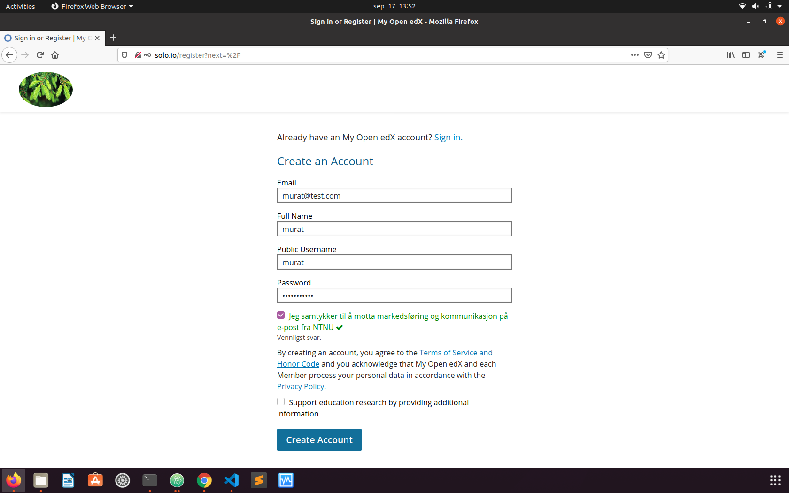
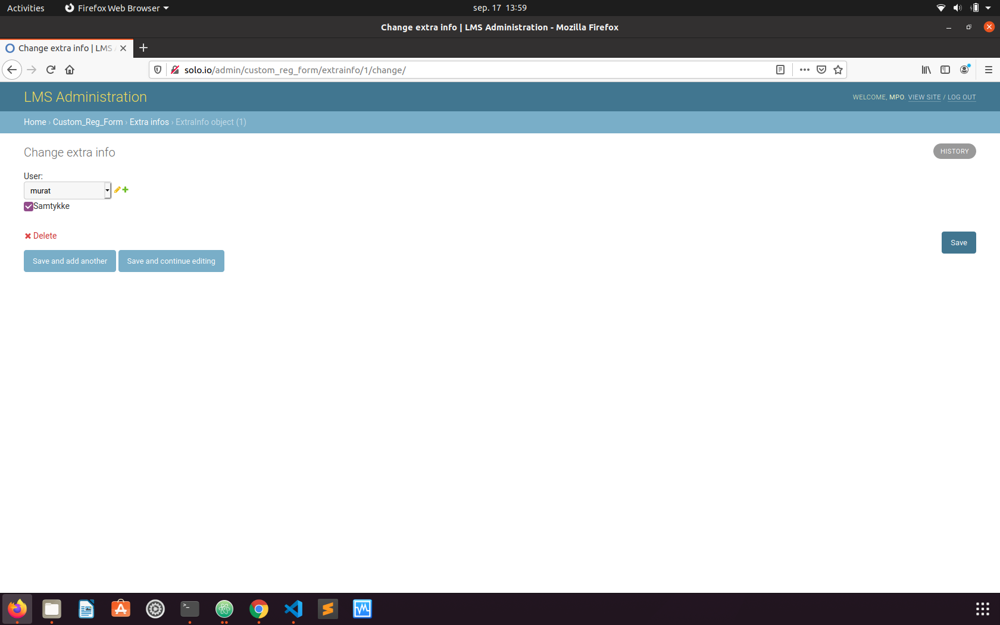

## Installation on tutor:

### app installation:

`cd .local/share/tutor/env/build/openedx/requirements   `

`git clone -b digit-extra https://github.com/NTNUbeta/custom-form-app `

`echo "-e ./custom-form-app" >>  private.txt `

`pip3 install -e custom-form-app `

### plugin activation:

`tutor plugins printroot  `

`mkdir "$(tutor plugins printroot)" `

`cd "$(tutor plugins printroot)" `

`nano minplugin.yml ` Then copy all cods from minplugin.yml and save

`tutor plugins list `

`tutor plugins enable minplugin `

`tutor config save `

`tutor images build openedx  `

`tutor local quickstart `

### Debug:

`tutor local run lms bash `

`./manage.py lms makemigrations `

`./manage.py lms migrate `

To delete and recreate migrations:
(This step is important if you changed models !)

`./manage.py lms migrate custom_reg_form zero `

Than

`./manage.py lms makemigrations `

`./manage.py lms migrate`

